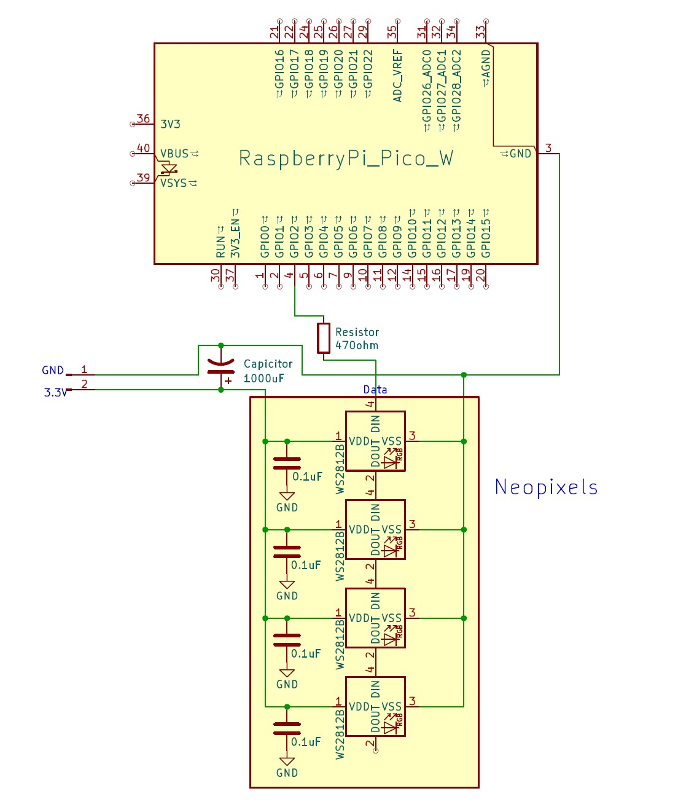

# Penn State Harrisburg IEEE Neopixel Workshop

Build a 7‑LED Neopixel project driven by an Arduino Nano and powered from a USB charger. This repo includes starter code, wiring/power notes, a step‑by‑step process, and troubleshooting.

## Quick Start
- Install the Arduino IDE.
- Install the Arduino Mbed OS RP2040 Boards by Arduino
- Install the “FastLED” library by Daniel Garcia (Library Manager).
- Set your board to Raspberry Pi Pico on your COM port.
- Open `Pico_Neopixel_Codes/neopixel_starter_code`, set `NUM_LEDS` to 7, choose your data pin, and upload.
- Power the Neopixel strip from a wall charger; power the microcontroller from your laptop.

## Wiring (summary)


- Wall charger 5V -> Breadboard Power Supply -> LED strip 3.3V  
- Neopixel strip GND -> Breadboard Power Supply GND 
- Pico GND -> Breadboard Power Supply GND (common ground)  
- Pico GPIO2 -> 330–470 Ω -> LED DIN  
- 1000 µF electrolytic across LED 5V/GND near the first LED (This will be needed when you scale up to a much larger Neopixel strip.)

Notes:
- Do not power the strip from the Pico’s 3.3V pin.
- If using a 3.3 V MCU (ESP32/ESP8266/RP2040), and a 5V power supply to the Neopixels, use a 74AHCT125/74HCT14 level shifter on the data line or lower LED V+ to ~4.3–4.5 V with a diode in series.

## Power Notes
- One 7‑LED strip worst case ≈ 7 × 60 mA = 0.42 A at 5 V (full white, full brightness).
- Cap brightness in code (e.g., 25–40%) for comfort and headroom.
- Our wall charger can only handle up to 1A so be mindful of how you power the pixels.
- Neopixels are rated for 5V, so if you power them at their rated voltage ensure the microcontroller you use is at 5V logic or use a level shifter.

## Starter Code (Pico, 3.3V logic)
See `Pico_Neopixel_Codes/neopixel_starter_code`. Paste into the Arduino IDE.

```cpp
#include <FastLED.h>

#define DATA_PIN 2 // Pin connected to data line
#define NUM_LEDS 7 // Number of LEDs on your strip
#define LED_TYPE WS2812 // Part Number of the Neopixels
#define BRIGHTNESS 50  // ~25% to keep current modest

CRGB leds[NUM_LEDS];

void setup() {

  delay(2000); // Power-up safety delay
  FastLED.addLeds<LED_TYPE, DATA_PIN, GRB>(leds, NUM_LEDS); // If color order seems off, modify GRB (Green, Red, Blue)
  FastLED.setBrightness(BRIGHTNESS);
  //Optional: Cap max power draw
  //FastLED.setMaxPowerInVoltsAndMilliamps(5, 500);
}

void loop() {

  fill_solid(leds, NUM_LEDS, CRGB::Black); // Clear all
  leds[0] = CRGB::Red; // First LED red
  leds[1] = CRGB::Blue; // Second LED blue
  leds[2] = CRGB::Green; // Third LED green
  FastLED.show();
  delay(100);
}

```
ESP32/RP2040 Option
If you use 3.3 V boards, while keeping power at 5V, add a level shifter (SN74AHCT125/74HCT14) or drop LED V+ to ~4.3–4.5 V with a diode. 


